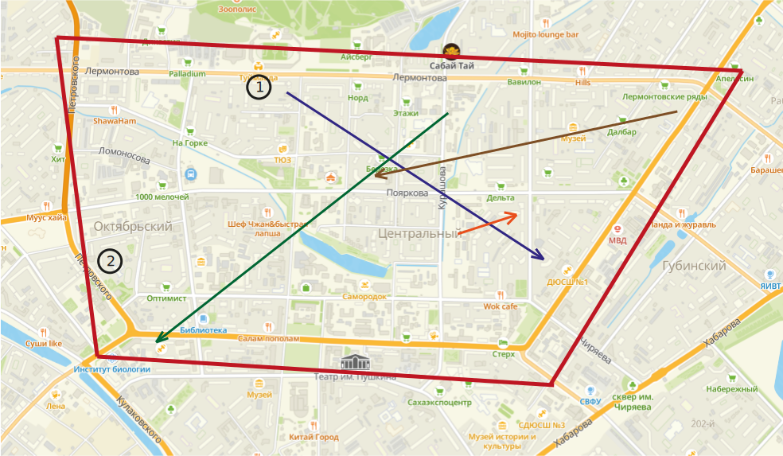

# Тестовое задание на должность Junior Developer в Drivee
### Задача
Написать алгоритм распределения заказов между курьерами, чтобы был приоритет в
скорости доставки посылки клиентам.
Входные параметры:
* Список заказов:
* * Параметры заказа:
* * *  Гео-координаты точки А (Откуда)
* * * Гео-координаты точки Б (Куда)
* * * Стоимость заказа
* Список курьеров
* * Параметры курьера:
* * * Гео-координаты курьера

Срок выполнения 3 дня

---

Данная задача очень похожа на задачу коммивояжера с несколькими путешественниками (Multiple Traveling Salesman Problem, MTSP) является расширением классической задачи коммивояжера, где несколько продавцов должны посетить некоторое количество городов, минимизируя общую длину маршрута.

Решение задачи MTSP является NP-трудной, что означает, что для больших наборов данных поиск оптимального решения может быть вычислительно сложным. Однако существуют некоторые методы и алгоритмы, которые могут помочь приближенно решить задачу MTSP.

Один из таких методов - это разделение задачи (Task Partitioning), который заключается в разделении набора городов на несколько поднаборов, которые затем решаются отдельно для каждого путешественника. Это позволяет упростить задачу и использовать уже существующие алгоритмы для решения задачи коммивояжера на каждом поднаборе городов.

Другой метод - это генетические алгоритмы (Genetic Algorithms), которые используют эволюционную оптимизацию для нахождения аппроксимации оптимального решения. Генетический алгоритм может быть настроен для учета условий MTSP и проводить эволюцию маршрутов для каждого путешественника.

В моем решении я не успел реализовать ни один из этих алгоритмов, но предлагаю решение, которое справляется быстрее чем полный перебор всех вариантов (хоть и не так эффективно)

Основная задумка алгоритма в том, чтобы просчитывать на каждый шаг какой путь потребуется преодолеть водителю, чтобы выполнить очередной заказ, стараться сделать так, чтобы каждый водитель проехал примерно равное расстояние

---

### Пример работы алгоритма

Были сгенерированы 4 заказа и 2 курьера

Алгоритм отработал по такому маршруту:
### 1 Курьер

* Выполняет синий заказ
* Выполняет коричневый заказ

### 2 Курьер

* Выполняет оражевый заказ
* Выполняет зеленый заказ

---
Программа может генерировать список курьеров и заказов, а так же принимать данные от пользователя

Генерация происходит внутри красного 4-х угольника (на картинке выше)